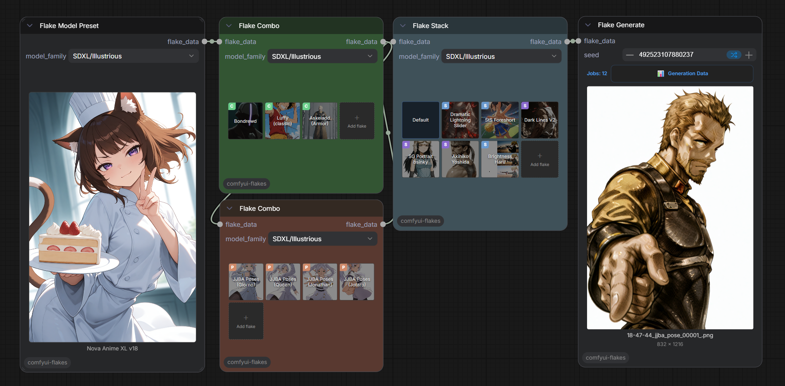
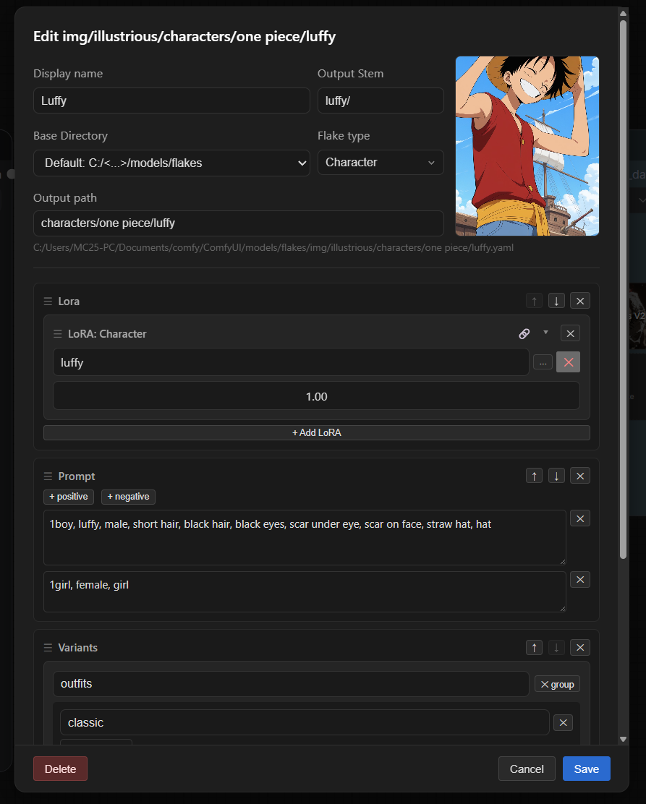
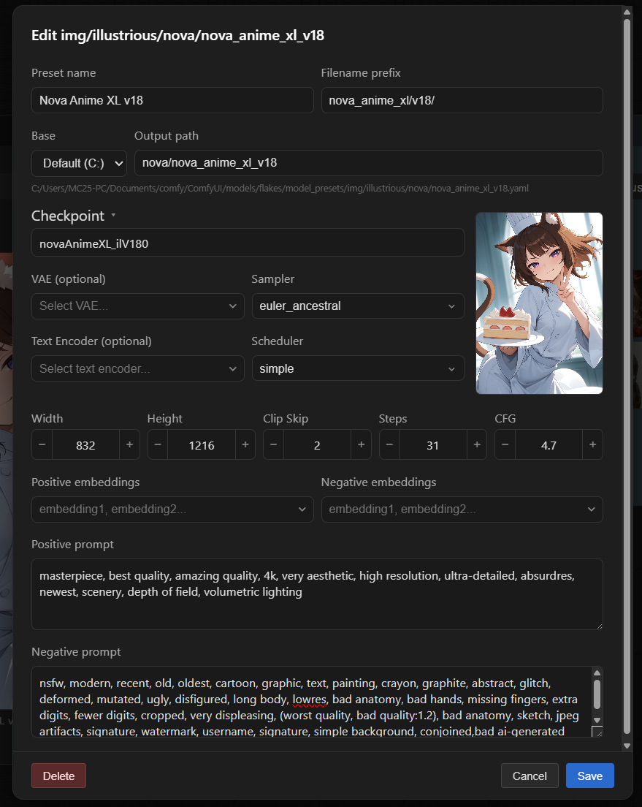
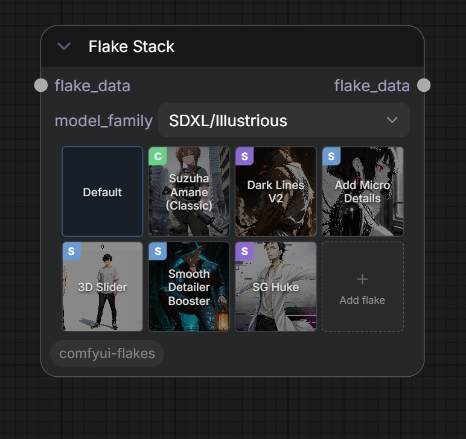
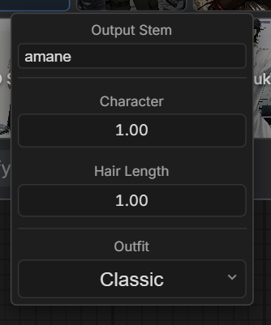

<div align="center">


**Reusable config presets — swap characters, styles, poses, checkpoints and more without rewiring your workflow**

ComfyUI Flakes is a set of nodes aiming to facilitate batch generation of images with reusable presets. Combine LoRAs, prompts, controlnets and more into a `flake.yaml` file that can be loaded, swapped, disabled and tweaked easily within the Flakes ecosystem. 



</div>

---

## Installation

**Via ComfyUI Manager** (Recommended)

Search for **ComfyUI Flakes** and click Install.

**Manual**

```bash
cd ComfyUI/custom_nodes
git clone https://github.com/JeyzerMC/comfyui-flakes
```

No extra dependencies — PyYAML is already part of ComfyUI's core.

---

## Flake file format

Flakes are reusable `.yaml` config files under `ComfyUI/models/flakes/`. They can represent any image generation concept, such as a character, a style, an environment, a pose, etc. Each flake has a number of different fields it can have that will be passed during the generation.

The only field required inside the YAML is `name` — the display label used everywhere in the UI. The flake's stable identifier is its filename relative to `models/flakes/` (subfolders included — `characters/musashi.yaml` is loaded as `characters/musashi`); that's the "output path" and lives in the filesystem rather than the file. Every other field below is optional — include only what your flake needs.

```yaml
# ─── Required ─────────────────────────────────────────────────────────────
name: "Miyamoto Musashi"        # Display name shown in the UI and pickers

# ─── Optional fields ──────────────────────────────────────────────────────

# Prompt fragments contributed to the stack. Either side can be omitted.
prompt:
  positive: "1boy, miyamoto musashi, long wild black hair"
  negative: "modern clothing, glasses"

# LoRAs — list of one or more entries. `path` is the model path under
# `models/loras/`; `name` and `url` are metadata for the picker / link icon.
loras:
  - name: "Musashi"
    url: "https://civitai.com/models/..."   # optional, shown as link icon
    path: "<lora_path>/musashi"                # under models/loras/
    strength: 0.9                           # default 1.0

# Default resolution for the generation. The first flake in the stack that
# declares a `resolution` wins; otherwise it falls back to 1024 × 1024.
resolution: [832, 1216]

# Cover image shown on the flake's grid block and in the picker. Path is
# resolved under `models/loras/` (or, for legacy flakes, the sibling image
# of a .safetensors file).
cover_image: "<lora_path>/musashi.png"

# Variant groups — the UI lets you pick one choice per group. Each choice
# can contribute extra positive/negative text and an optional preview image.
variants:
  outfit:
    ronin:
      positive: "tattered kimono, frayed hakama"
      negative: "armor"
      image: "<lora_path>/musashi_outfit_ronin.png"    # optional preview thumbnail
    shirtless:
      positive: "shirtless, hakama only"
  mood:
    calm:
      positive: "serene expression"
    fierce:
      positive: "battle stance, narrowed eyes"

# ControlNets — one entry per ControlNet to apply.
controlnets:
  - type: openpose                            # ControlNet category label
    model: control_openpose_xl.safetensors    # file under models/controlnet/
    image: standing_openpose                  # file under ComfyUI/input/
    strength: 0.8                             # default 1.0
    start_percent: 0.0                        # default 0.0
    end_percent: 1.0                          # default 1.0

# Filename stem injected into `Save Image`'s filename_prefix when this flake
# is in the stack. Multiple flakes' stems are joined with underscores.
output_stem: "musashi"

# Flake links — pull in one or more other flakes' loras + prompts when this
# flake is used. Each link can set default variant choices and lora-strength
# overrides for its target. (A single legacy `flake_link:` mapping is still
# read for backwards compatibility.)
flake_links:
  - target: "styles/ink_wash"          # another flake's output path
    variant:
      intensity: heavy                 # default variant choice on the target
    lora_strengths: [0.8]              # per-lora overrides (null = target default)
  - target: "poses/standing"
```

Prompts are joined with `BREAK` between flakes so each flake acts as an independent CLIP region. LoRA strengths and variant choices can be overridden per-instance from the grid item's option panel without modifying the file on disk.



---

## Flake Model Preset

A Flake model preset is a config for checkpoints. They currently support SDXL based checkpoints, and will be extended to work for other architectures as well. 



---

## Nodes

### Flake Stack

Sits between your checkpoint loader and sampler. Loads an ordered list of **flakes** (YAML presets), merges their prompts and LoRAs, and outputs everything the sampler needs.



Flakes can be reordered, enabled / disabled, and edited. You can also open a small dropdown menu to make small non-persistent tweaks, such as changing a variant option, or a lora strength.

<div align="center">



</div>

### Flake Combo

TODO

### Flake Model Preset

TODO

### Flake Model Combo

TODO

### Flake Generate

TODO

### Flake Data Split

TODO 

---

## Roadmap

- Z-Image / Flux / Anima support
- Video support (Starting with WAN)
- Post Process (ADetailler / Upscalers)
- IP Adapters
- LoRA training
- Controlnet preprocessing
- Variant LoRAs? 

Fill free to open an issue if you'd like more features supported by Flakes.

---

## Changelog

See [CHANGELOG.md](CHANGELOG.md) for the full release history.

---

## License

[MIT](LICENSE)
